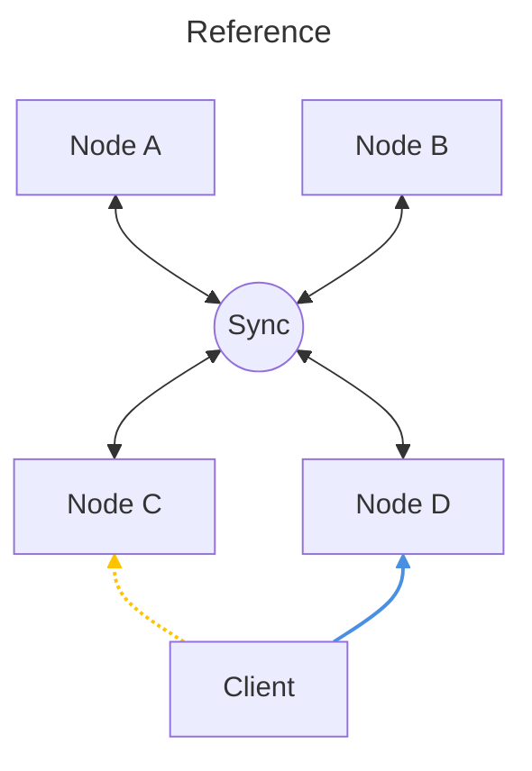

[](README.md) [](README-EN.md)

> [!CAUTION]
> **Machine Translated Version:** This document has been translated using AI. As the official course language is German, the [German README](README.md) remains the authoritative and ruling version in case of any discrepancies or errors.

# SPECIFICATION TEVS FINAL PROJECT

In addition to the lectures of the "Technologies of Distributed Systems" course, you are to complete a final project in the form of project work.

## PROGRAMMING PROJECT

* **Number of persons:** maximum 3 persons.

The final project involves developing a distributed application whose backend consists of several equivalent service instances. It must be possible via a client to create, modify, delete, and retrieve a remote object with several attributes in a distributed manner. To maintain high availability, it must be possible for several backend service instances holding the objects to run redundantly across multiple servers (nodes). In the event of a backend service instance failure, the client service should have no noticeable effects (outages, data loss). Likewise, no data loss should occur through the replication of objects. Basically, a replicated key-value store with a control client.

### Framework Parameters and Technologies

The technologies for implementation are freely selectable as long as the following framework parameters are met:

* Installation of distributed database systems or other external applications is not allowed (exceptions are applications such as message brokers, e.g., RabbitMQ or Eclipse Mosquitto).

* Replication and fault-tolerance mechanisms must be implemented within your application; no existing libraries that implement this logic should be used. As a developer, you should conceptually engage with this.

* You can choose any high-level programming languages.

* If you use middleware technologies like RabbitMQ, you do not need to install them in a fault-tolerant (fail-safe) manner; a single instance is sufficient. However, your server nodes must run fail-safely.

* The middleware itself should not be used as a buffer for any messages, but purely as a communication medium.

* No third-party services (such as databases, replication libraries) that handle replication may be installed and/or used.

* However, a local database for individual nodes, such as H2, is allowed.

In addition to the suggested project below, you can also come up with your own distributed application and coordinate it with the lecturer. However, the descriptions mentioned above should be adhered to.

---

## Standard Project: Distributed Command Center

As a final exercise, a distributed system is to be developed that allows users to send text-based status messages with geodata to a server. The server stores these and makes them available to other clients. An example of a status could be, for example:

```json
{
  "username": "RECON-01",
  "statustext": "On the way to the mission",
  "time": "2026-03-03T13:30:00+01:00",
  "latitude": 48.2150,
  "longitude": 16.3850
}
```

Status Class:

| Attribute      | Type          | Description                               |
|:---------------|:--------------|:------------------------------------------|
| **username**   | String        | Unique identifier of the user.            |
| **statustext** | String        | The actual status message.                |
| **time**       | ISO-Timestamp | Time of creation/modification.            |
| **latitude**   | Float         | Geographic latitude.                      |
| **longitude**  | Float         | Geographic longitude.                     |

To increase availability and implement fault tolerance, server instances are replicated. A consistency mechanism must be built with the replication, which allows a status message to be replicated across all servers and kept consistent.

### System Components

As a possible basis, the system can be divided into the following components:

#### Status Server Nodes (Server Nodes)

* Status server nodes are server services that receive status messages or communicate them to the client upon request.

* As soon as a client communicates a status, the server node stores the status in its own "database" or data structure.

* Furthermore, server nodes have the ability to replicate the status with other server nodes.

* When a server node receives a status shared by another server node, it adopts the status into its own "database" or data structure. (However, it validates in advance whether the update is legitimate).

* Replication should be implemented to the extent that the user can assume at any time to receive the most current status, regardless of which server node is contacted.

* It should also be possible for a subsequently started server node to reload the existing status messages from other server nodes.

#### Clients


* Clients have a simple user interface that allows setting, changing, retrieving, and deleting a status of any user.

* The client sends the request to any status server node and displays the response on the user interface.

* The user interface must have a web-based graphical interface and integrate a map view for visualizing the geodata. (Libraries may be used for the frontend).

#### **Example Architecture Status Server:**



The example shown above shows 4 server nodes (Node A, B, C, D) that store received status messages and replicate them among themselves (see Sync cloud). The client can contact any node to set, delete, change, or retrieve a status. The contacted server node distributes the received status to the other server nodes. If, for example, Node D fails, the client has the option to contact any other server node and receives the same data back or can continue to set/delete a status.

### Non-Functional Requirements

#### System Requirements

##### 1. Reliability & Availability (NFA)

**High Availability:** The overall system must have an availability of $n+1$. A single failure (node or service) must not cause a system stop.
**Resilience:** Elimination of Single Points of Failure (SPoF) and Shared Fates (e.g., no shared hardware/power supply for redundant nodes).
**Fault Tolerance:** Interruptions in the backend must not affect the usability of the client (e.g., through local caching or retry mechanisms).

##### 2. Scalability & Capacity (NFA/Constraint)

**Minimum Configuration:** The system must run on at least 2 status server nodes.
**Simultaneous Users:** Support for at least 10 simultaneous clients.
**Storage Capacity:** The system must be able to hold at least 100 status messages persistently or in RAM.

##### 3. Consistency & Performance (NFA)

**Eventual Consistency:** The system must reach a consistent state across all nodes after 15 seconds at the latest. Stricter consistency models can also be chosen.

##### 4. Security (NFA)

**Encryption (Transport Encryption):** The system must transmit status messages between the nodes as well as between client and server in encrypted form. Likewise, all interfaces (e.g., REST APIs) and any web interfaces must be secured via encrypted connections (e.g., HTTPS/TLS). (Self-signed certificates are allowed)

### Functional Requirements

#### Server Functions

1. **Initial Sync / Bootstrapping:** If a new or failed server node starts, it is in a "grace period". In this phase, it must actively request the existing status messages from the other active nodes in the cluster and store them locally before answering its own client requests (read or write access).

2. **Conflict Resolution:** Since the system aims for "eventual consistency", conflicts can occur (e.g., if two clients update the same username on different nodes at the same time). The system must implement a deterministic rule for conflict resolution (e.g., "Last-Writer-Wins" based on the `time` attribute).

3. **Validation of Updates:** When a server node receives a replicated status message from another node, it must be validated before saving whether this message is actually newer than the status already available locally. Outdated messages must not overwrite the current status.

#### Client Functions

1. **Setting a Status:**
It must be possible from the client to send a status to the server nodes. For this purpose, the username and status text can be specified via a user interface. **In addition, geocoordinates (latitude and longitude) must be recorded (e.g., by manual entry, clicking on a map, or automatic location determination).**

2. **Retrieving a Status:**
Every client must have the possibility to retrieve a status from a server node. Here, the status object is passed from the server node to the client. The client displays the queried status to the user **and visualizes the position on a map.**

3. **Deleting a Status:**
Every client must have the possibility to delete a status from a server node. The deletion of the status must also be carried out on all other server nodes via internal replication in the backend. The client expects a confirmation, and the user is shown a confirmation of the successful deletion.

4. **Changing a Status:**
If a user including status text already exists, the status must be updated accordingly. Duplicate entries with the same username must be avoided at all costs.

5. **Retrieving all Status Messages (List Function):** In addition to retrieving a specific user, the client must offer the possibility to retrieve and display a list of all status messages (feed) currently present in the distributed system. **The locations of all status messages should be displayed on a common map.**

### General Aspects

Consider the following aspects when developing the service:

* **Architecture:** Choose a suitable system architecture to meet the mentioned requirements.
* **Processes:** The system should be able to serve multiple users (threading necessary?).
* **Communication:** Choose a suitable communication technology (RESTful web services, AMQP, ...) that allows fast synchronization.
* **Naming:** Are naming systems necessary?
* **Synchronization:** How do you manage your system time, is it important?
* **Consistency and Replication:** Status messages should be replicated to all nodes. How do you prevent inconsistency in your system?
* **Fault Tolerance:** Failures of individual components must not affect the overall system; what measures do you implement for this in your system?
* **Security:** Implement the required measures for transport encryption (TLS).

---

## 1.2 GRADING

The grading of the project work is based on the general school grading principle. Depending on the complexity of the topic, clarity, and approach, a grade between 1-5 is awarded.

| Type                                                           | Weighting |
|---------------------------------------------------------------|------------|
| Knowledge about the solution and individual knowledge (individual) | 20%        |
| Functionality and required functions                          | 50%        |
| Replication mechanism                                         | 15%        |
| Fault tolerance                                               | 15%        |
