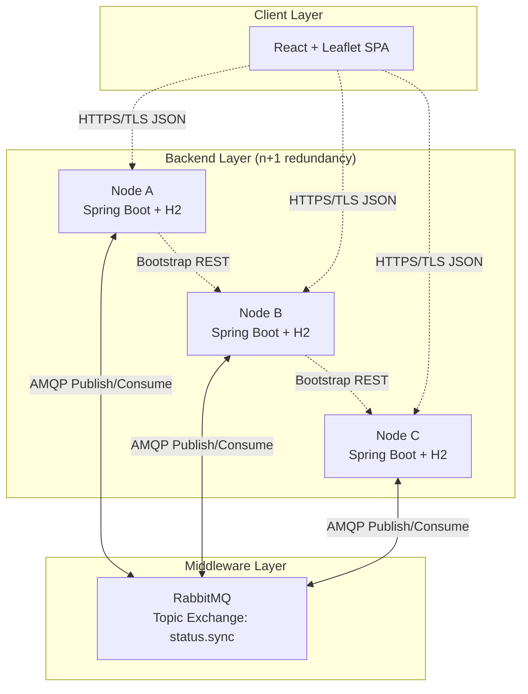

# High-Level Architecture: Distributed Command Center

## 1. System Overview

The system consists of **four primary layers**:
1. **Client (Frontend)** – React web application for CRUD operations and map visualization.
2. **Server Nodes (Backend)** – Multiple equivalent Spring Boot instances, each holding a local H2 database.
3. **Synchronization Bus (Middleware)** – RabbitMQ used purely as a communication medium for replication events.
4. **Persistence (Per-Node)** – Embedded H2 database on every node; no external shared database.

---

## 2. Component Diagram

---

## 3. Component Descriptions

| Component | Technology | Responsibility |
|-----------|------------|--------------|
| **React Client** | React 18 + Vite + Leaflet | Provides UI for creating, reading, updating, and deleting statuses; visualizes geodata on an interactive map. |
| **Spring Boot Node** | Java 21 + Spring Boot 3.x | Hosts REST API, manages local H2 persistence, publishes/consumes replication events, handles bootstrapping. |
| **H2 Database** | Embedded H2 (file or in-memory) | Stores `status_messages` table locally on each node. |
| **RabbitMQ** | RabbitMQ 3.x (single instance) | Topic exchange `status.sync` broadcasts mutation events to all subscribed nodes. Used **only** as a communication pipe; does not buffer messages indefinitely. |
| **TLS/Keystore** | Self-signed PKCS12 | Encrypts all client-server and internal REST traffic (HTTPS). |

---

## 4. Interaction Flows

### 4.1 Client Write (Create/Update)
1. User fills the status form and submits.
2. React client sends `POST /api/status` via HTTPS to **Node A**.
3. Node A validates the payload, persists to local H2, and publishes a `StatusEvent` to RabbitMQ.
4. RabbitMQ routes the event to all active queues (`queue.node-a`, `queue.node-b`, ...).
5. Node B and Node C consume the event, validate it (LWW), and update their local H2.
6. Node A returns `200 OK` to the client immediately after local persistence.

### 4.2 Client Read
1. React client sends `GET /api/status/{username}` via HTTPS to **Node A**.
2. If Node A is down, the client retries **Node B** (failover logic).
3. The responding node queries its local H2 and returns the JSON status.
4. React displays the status text and pans the Leaflet map to the coordinates.

### 4.3 Node Bootstrap (Grace Period)
1. A new node starts with state `BOOTSTRAPPING`.
2. It sends `GET /api/sync/all` to a configured peer (e.g., Node B).
3. It bulk-inserts the received data into H2 using Last-Writer-Wins.
4. It starts listening to RabbitMQ.
5. State transitions to `ACTIVE`; the node begins accepting client traffic.

---

## 5. Design Rationale Summary

- **Decentralized Writes:** Any node can accept mutations; there is no single master, eliminating a write-time SPoF.
- **Eventual Consistency via Async Replication:** Fire-and-forget AMQP broadcast gives fast client response times while nodes converge in < 15 seconds.
- **Local Persistence per Node:** H2 requires zero external installation and allows each node to serve reads independently even if RabbitMQ is temporarily unavailable.
